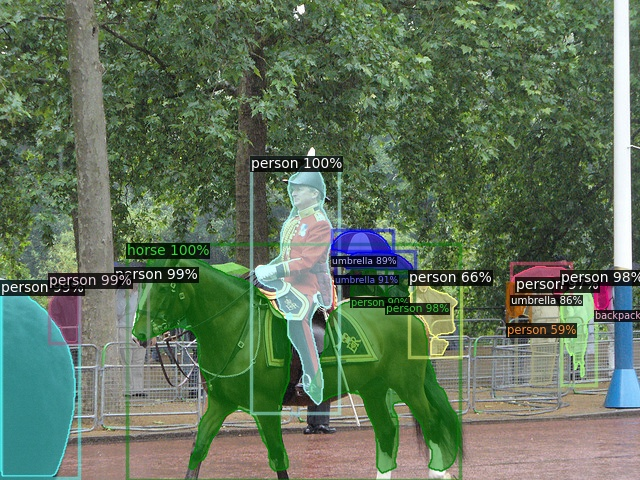

# Image Segmentation Instrumentation

This repository contains instrumentation to utilize a [Docker](https://www.docker.com/) image
that contains a popular segmentation model [detectron2](https://github.com/facebookresearch/detectron2).

We utilize a forked version of [detectron2](https://github.com/onai/detectron2).

Our instrumentation does the following:

* clone and set up the base repository.
* build image, cache pre-trained models, and produce predictions on this input image.

We depend on docker version [>= 19.03](https://docs.docker.com/engine/release-notes/).

## Execution

We use a Makefile for instrumentation of a popular open source model [detectron2](https://github.com/facebookresearch/detectron2).

Obtain detectron:

```
make clone
```

This downloads detectron.

```
make make_dir
```

This sets up the expected directory structure.

We use a sample image to demonstrate the feature. First obtain the image using:

```
wget http://images.cocodataset.org/val2017/000000439715.jpg -O input.jpg
```

Now, we set up the input image for segmentation.

```
make input_image img=input.jpg
```

Now we run segmentation:

```
make run img=input.jpg
```

Which will store the visualization at `outputs/input.jpg` and the torch tensors at `outputs/input.jpgpredictions`.

You may of course parse the tensors directly for use. But you may also utilize the interactive setting to inspect models. The interactive setting drops into a Docker container that contains
the detectron repository. From there, models can be executed following the instructions at [detectrons2](https://github.com/onai/detectron2).

The model's prediction object contains the key `instances` which contains a list of `Instances` objects:

```
Instances(
	num_instances=1,
	image_height=480,
	image_width=640,
	fields=[
		pred_boxes: Boxes(...),                      # box coordinates
		scores: tensor(...),                         #
		pred_classes: tensor([17], device='cuda:0'), # prediction
		pred_masks: tensor(),                        # prediction masks
	)
```

The sample output visualized:




Utilize the interactive setting to inspect models. The interactive setting drops into a docker container that contains
the detectron repo. From there, models can be executed following the instructions at [detectrons2](https://github.com/onai/detectron2).

```
make interactive
```

Inside the image, detectron2 is cloned, and available for execution. We can utilize it for inspecting the dumped predictions.


